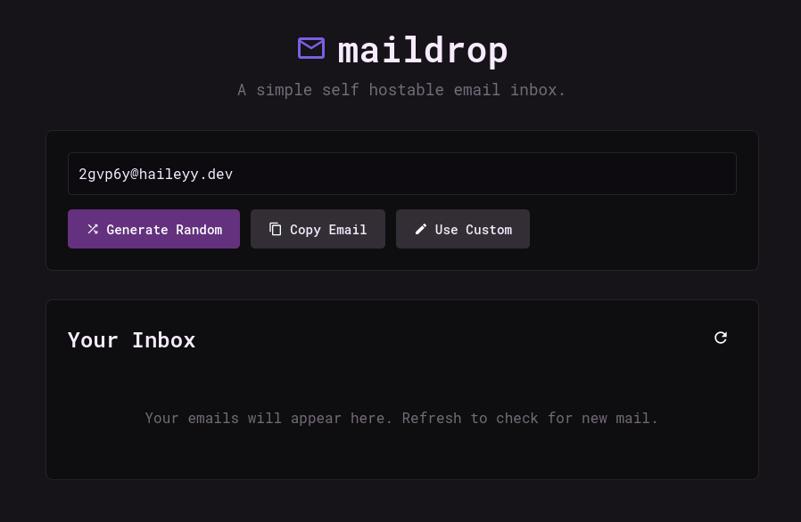

<h1>
    
    Maildrop
</h1>

*A simple self hostable email inbox*



## Table of Contents
- [Table of Contents](#table-of-contents)
- [About The Project](#about-the-project)
  - [Features](#features)
- [Getting Started](#getting-started)
  - [Prerequisites](#prerequisites)
  - [Installation](#installation)
  - [Running with docker](#running-with-docker)
- [Connecting to your domain](#connecting-to-your-domain)
  - [Example DNS configurations](#example-dns-configurations)
- [Configuration](#configuration)
- [Sending](#sending)
- [API Reference](#api-reference)
- [License](#license)

## About The Project

Maildrop is a self hostable and easy to use email service that allows you to receive emails on any address on your domain.  

It is perfect for:
- People who want to easily use multiple email addresses.
- Signing up for services without without using your main email address.
- Easily creating multiple accounts on websites.

### Features

- [x] Random email generation
- [x] Use custom emails
- [x] Support for password protected inboxes
- [x] Clean UI
- [x] Easy setup
- [x] Automatic inbox clearing
- [x] (Optional) Sending Emails  
[Set up sending](#sending)

## Getting Started

If you wish to install maildrop and run it with python, follow this guide, if you wish to install it with docker instead, then proceed to [Running with Docker](#running-with-docker).

### Prerequisites

- Python 3
- pip

### Installation

1.  **Clone the repository**

    ```bash
    git clone https://github.com/haileyydev/maildrop.git
    cd maildrop
    ```

2.  **Create a venv and activate it**

    ```bash
    python -m venv venv
    source venv/bin/activate
    ```

3.  **Install the requirements**

    ```bash
    pip install -r requirements.txt
    ```

4.  **Run the application**

    ```bash
    sudo python app.py
    ```

Maildrop will be running on port 5000 and the smtp server on port 25.

**The application must be run as root for the SMTP server to work**

### Running with docker

Alternatively, you can run maildrop inside of a docker container using the official docker image.

Use this command to run maildrop in a docker container:
```
sudo docker run \
  -d \
  --restart unless-stopped \
  --name maildrop \
  -p 5000:5000 \
  -p 25:25 \
  -e DOMAIN="yourdomain.com" \
  haileyydev/maildrop:latest  
```
Or if you prefer docker compose, Add this to your compose.yml file:
```
services:
  maildrop:
    image: haileyydev/maildrop:latest
    container_name: maildrop
    restart: unless-stopped
    ports:
      - "5000:5000"
      - "25:25"
    environment:
      - DOMAIN=yourdomain.com
```
and then start it: `sudo docker compose up -d`


## Connecting to your domain  

Follow this guide to set up receiving emails on your domain.

1. **Ensure port `25` is open**  
This is the port the smtp server uses. Some ISPs block this so you may need to use a tunnel or host maildrop in the cloud.
2. **Create an `A` record in your dns settings**  
Create this on the domain you want the maildrop running on. The ip address should be pointed to the public ip address of the server running maildrop.
3. **Create an `MX` record in your dns settings**  
Create this on the domain you want emails to be sent to. It should be pointed to the domain you created your `A` record on.
4. **Edit `.env` and change the domain to your domain**  
Edit the .env file and set `DOMAIN` to the domain you are receiving emails on (so the domain you created the MX record on). This is used for email address generation. If you are using docker, edit the DOMAIN environment variable directly.

---

### Example DNS configurations
This is what the dns configuration should look like once you have created the records.

---

**If you are running maildrop on a different domain/subdomain than the one you are receiving emails on:**

| Type | Domain                | Points To                |
| ---- | --------------------- | ------------------------ |
| `A`  | `maildrop.domain.com` | Your server's IP address |
| `MX` | `domain.com`          | `maildrop.domain.com`    |

In this configuration, you would be able to access maildrop from http://maildrop.domain.com:5000 (or preferably https://maildrop.domain.com if you are running a reverse proxy with https)

---

**If you are running maildrop on the same domain/subdomain than the one you are receiving emails on:**

| Type | Domain       | Points To                |
| ---- | ------------ | ------------------------ |
| `A`  | `domain.com` | Your server's IP address |
| `MX` | `domain.com` | `domain.com`             |

In this configuration, you would be able to access maildrop from http://domain.com:5000 (or preferably https://domain.com if you are running a reverse proxy with https)

## Configuration

Edit .env to change these or set environment variables if you are using docker. These are currently all of the options

| Variable              | Description                                           |
| --------------------- | ----------------------------------------------------- |
| `FLASK_HOST`          | The host for the website.                             |
| `FLASK_PORT`          | The port for the website.                             |
| `SMTP_HOST`           | The host for the SMTP server.                         |
| `SMTP_PORT`           | The port for the SMTP server.                         |
| `INBOX_FILE_NAME`     | The file where emails are stored.                     |
| `MAX_INBOX_SIZE`      | The maximum size of the inbox.                        |
| `PROTECTED_ADDRESSES` | A regex for inboxes that require a password.          |
| `PASSWORD`            | The password for protected inboxes.                   |
| `DOMAIN`              | The domain to be used for generating email addresses. |

## Sending
Maildrop also supports sending mail as an optional feature. Visit the [Sending Guide](docs/SENDING.md) for instructions.

## API Reference
Visit the [API Reference](docs/API.md) for instructions on interacting with maildrop via the simple JSON API.

## License

Distributed under the GNU General Public License v3.0.