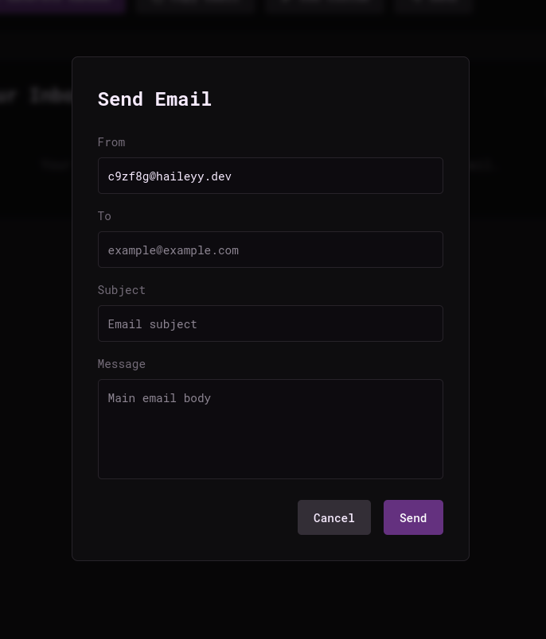

## Sending Emails

Sending emails is an optional feature in maildrop.

## SMTP Relay

To set up the email sending feature in maildrop, you must use an SMTP relay. I recommend using [SMTP2GO](https://www.smtp2go.com/) as they have a generous free tier which allows 1000 emails per month. It is free, quick and easy to sign up and set up with maildrop. You can also use gmail's SMTP server for free but it is a bit trickier to set up.

## Configuring Maildrop

Once you have set up your smtp relay, you must configure maildrop to send through it.  

All configuration is done with environment variables or by editing the `.env` file.

1. **Enable sending in maildrop**  
   you need to enable the send mail feature first as it is in optional feature.  
   do this by setting `ENABLE_SENDING` to `true` in the configuraion.
2. **Configure maildrop to use your SMTP relay**  
   you must set these 4 parameters to make maildrop use the SMTP relay
   | Variable              | Description                                           |
   | --------------------- | ----------------------------------------------------- |
   | `RELAY_HOST`          | The hostname of the relay. e.g: `mail.smtp2go.com`|
   | `RELAY_PORT`          | The port of the relay. e.g: `2525` |
   | `RELAY_USER`           | The username to login to the relay.|
   | `RELAY_PASS`           | The password to login to the relay.|